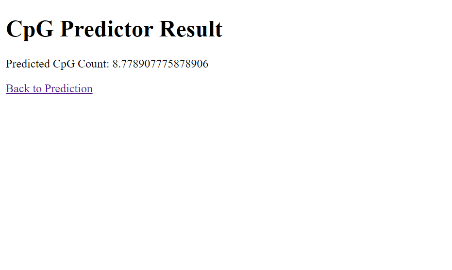

# cpg-detecor

CpG Detector is a neural network-based solution built with PyTorch to count the number of CpGs (consecutive CGs) in given DNA sequences. This repository contains the code for training the model and a Flask web application for inference.

## Setup and Usage
1. Clone this repository to your local machine:
```bash
git clone https://github.com/your_username/cpg-detector.git
```
2. Navigate to the project directory:
```bash
cd cpg-detector
```
3. Install the required dependencies using Poetry:
```bash
poetry install
```
## Download trained model files
```bash
poetry run python -m utils.download
```

## Running Unit Tests
```bash
poetry run python -m unittest discover .
```

## Running Flask App

#### Running fixed length predictions
```bash
poetry run python -m app.cpg_pred
```




#### Running variable length predictions
```bash
poetry run python -m app.cpg_var_pred
```

<p align="center">
  
&nbsp; &nbsp; &nbsp; &nbsp;
  
</p>

## Using Ngrok for Public IP
1. Download Ngrok from [here](https://ngrok.com/download) and follow the installation instructions for your platform.
2. Run Ngrok to expose your local Flask server to the internet:
```bash
ngrok http 5000
```
3. Ngrok will provide a public URL (e.g., **https://your-ngrok-id.ngrok.io**) that you can use to access your Flask app from anywhere.

## License
This project is licensed under the Apache 2.0 License - see the [LICENSE](LICENSE) file for details.
