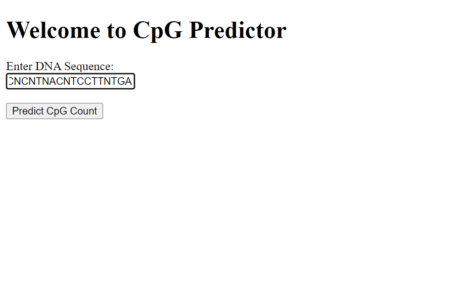
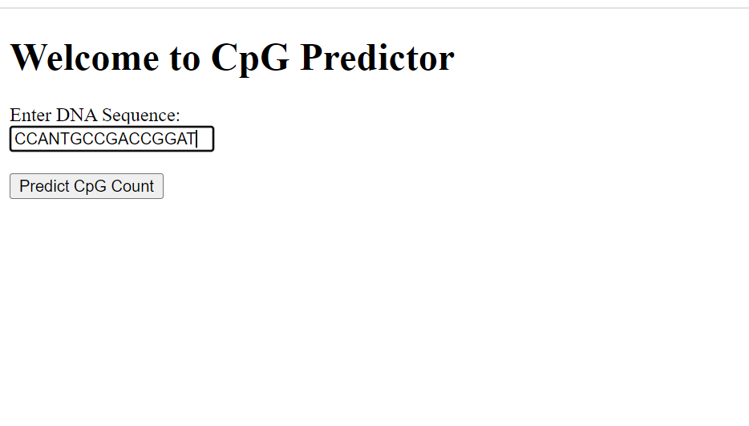
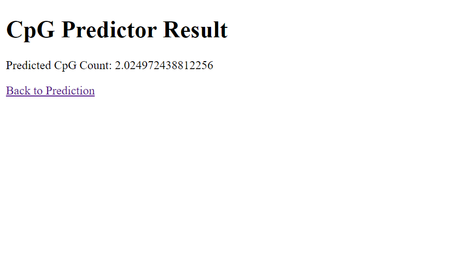
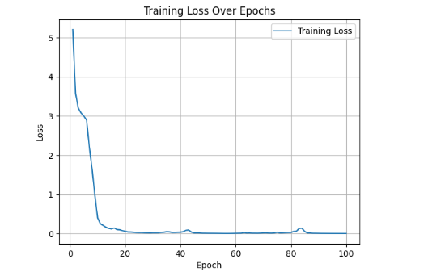

# cpg-detecor

CpG Detector is a neural network-based solution built with PyTorch to count the number of CpGs (consecutive CGs) in given DNA sequences. This repository contains the code for training the model and a Flask web application for inference.

## Setup and Usage
1. Clone this repository to your local machine:
```bash
git clone --depth 1 --single-branch https://github.com/realvenky/cpg-detecor.git
```
2. Navigate to the project directory:
```bash
cd cpg-detector
```
3. Install the required dependencies using Poetry:
```bash
poetry install
```
## Download Trained Model Files
```bash
poetry run python -m utils.download
```

#### To Download Trained Files Manually:
[Visit here](https://github.com/realvenky/cpg-detecor/releases/tag/0.1.0/)
<p>
  
**Note:**
1. Fixed Length CpG model - `model.pth`
2. Variable Length CpG model - `model_var_len.pth`

## Running Unit Tests
```bash
poetry run python -m unittest discover .
```

## Running Flask App

#### Running fixed length predictions
```bash
poetry run python -m app.cpg_pred
```

<p align="center">
  
&nbsp; &nbsp; &nbsp; &nbsp;
  
</p>

#### Running variable length predictions
```bash
poetry run python -m app.cpg_var_pred
```

<p align="center">
  
&nbsp; &nbsp; &nbsp; &nbsp;
  
</p>

## Using Ngrok for Public IP
1. Download Ngrok from [here](https://ngrok.com/download) and follow the installation instructions for your platform.
2. Run Ngrok to expose your local Flask server to the internet:
```bash
ngrok http 5000
```
3. Ngrok will provide a public URL (e.g., https://your-ngrok-id.ngrok.io) that you can use to access your Flask app from anywhere.

## Model Training
### Hyper Param Setting
1. Fixed Length Sequence Training:
```bash
LSTM_HIDDEN = 256
LSTM_LAYER = 2
batch_size = 64
learning_rate = 0.001
epoch_num = 50
input_size = 128
output_size = 1
```

2. Variable Length Sequence Training:
```bash
LSTM_HIDDEN = 256
LSTM_LAYER = 2
batch_size = 64
learning_rate = 0.001
epoch_num = 100
input_size = 128
output_size = 1
```

### Model Training Results

#### Train Loss
##### Fixed Length Sequence Training Loss graph:

  <p align="center">
  
  </p>
  
##### Variable Length Sequence Training Loss graph:
<p>
  <p align="center">
  
  </p>

#### Test Loss
1. Fixed Length Sequence Training:
 **`Test Loss: 0.19586889073252678`**
   
3. Variable Length Sequence Training:
   **`Test Loss: 0.29573648143559694`**
   
### Thought Process Behind Algorithmic Choices and Hyper Param Tuning
  [Refer this document](doc/readme.pdf)
## License
This project is licensed under the Apache 2.0 License - see the [LICENSE](LICENSE) file for details.
